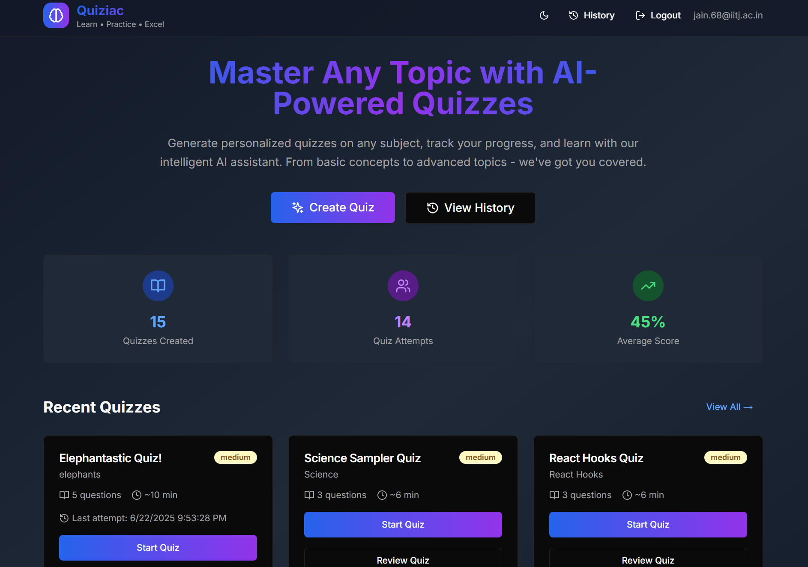
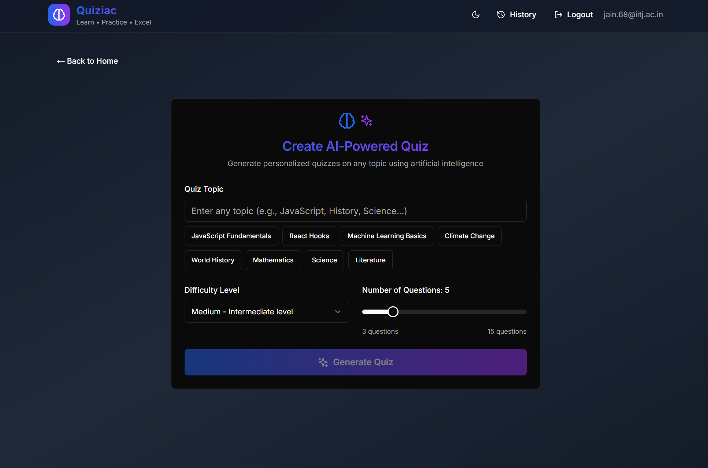
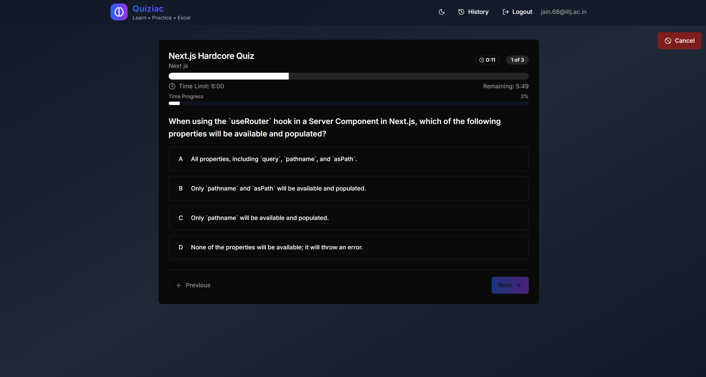
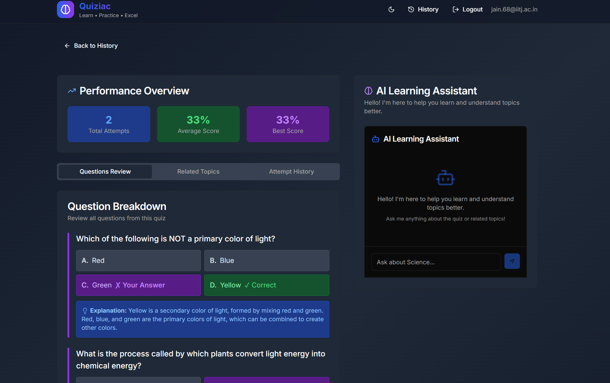

# Quiziac - AI-Powered Learning Platform

<div align="center">


**Transform your learning experience with AI-generated quizzes, real-time progress tracking, and intelligent study assistance.**

[🚀 Live Demo](https://quiziac11.vercel.app/) • [📖 Documentation](#features) • [🛠️ Tech Stack](#technical-architecture)





 

</div>
---

## ✨ Key Features

### 🎯 **AI-Powered Quiz Generation**

- **Intelligent Content Creation**: Generate quizzes on any topic using Google's Gemini 2.0 Flash AI
- **Customizable Difficulty**: Three levels (Easy, Medium, Hard) with progressive complexity
- **Flexible Question Count**: Create quizzes with 3-15 questions based on your needs
- **Smart Topic Suggestions**: Pre-built suggestions for popular subjects
- **Detailed Explanations**: Every question includes comprehensive explanations for learning

### 🎮 **Interactive Quiz Experience**

- **Real-time Progress Tracking**: Visual progress bar and question navigation
- **Timer System**: Automatic time limits with 2 minutes per question
- **Immediate Feedback**: Instant answer validation with visual indicators
- **Navigation Controls**: Move between questions freely during the quiz
- **Auto-save Functionality**: Never lose progress with persistent quiz state
- **Responsive Design**: Seamless experience across all devices

### **Comprehensive Analytics & Review**

- **Performance Analytics**: Detailed scoring and time analysis
- **Question-by-Question Review**: Review each answer with explanations
- **Historical Tracking**: Complete history of all quiz attempts
- **Advanced Filtering**: Search and filter by topic, difficulty, and date
- **Progress Visualization**: Visual charts and statistics
- **Related Topics**: AI-suggested topics for further learning

### **AI Learning Assistant**

- **Contextual Chat Interface**: Ask questions about quiz topics
- **Intelligent Responses**: AI-powered explanations and clarifications
- **Topic Exploration**: Deep dive into related concepts
- **Personalized Learning**: Adaptive responses based on quiz context
- **Real-time Assistance**: Get help during quiz review sessions

### **Modern User Interface**

- **Beautiful Design**: Modern UI with gradient backgrounds and smooth animations
- **Dark/Light Mode**: Complete theme support with system preference detection
- **Responsive Layout**: Optimized for desktop, tablet, and mobile
- **Accessibility**: WCAG compliant with keyboard navigation
- **Loading States**: Smooth loading animations and skeleton screens

---

## Technical Architecture

### **Frontend Stack**

- **[Next.js 14.1.0](https://nextjs.org/)** with App Router for optimal performance and SEO
- **[TypeScript 5.3.3](https://www.typescriptlang.org/)** for type safety and better development experience
- **[React 18.2.0](https://react.dev/)** with modern hooks and concurrent features
- **[Tailwind CSS 3.4.1](https://tailwindcss.com/)** for utility-first styling
- **[Radix UI](https://www.radix-ui.com/)** components for accessible, unstyled UI primitives
- **[Lucide React](https://lucide.dev/)** for consistent iconography

### **Backend & Database**

- **[Supabase](https://supabase.com/)** for real-time database and authentication
- **[PostgreSQL](https://www.postgresql.org/)** with JSONB for flexible quiz data storage
- **Row Level Security (RLS)** for data protection
- **Real-time subscriptions** for live updates

### **AI Integration**

- **[Google Gemini 2.0 Flash](https://ai.google.dev/gemini-api)** for intelligent quiz generation
- **Structured JSON responses** for reliable data parsing
- **Context-aware prompts** for relevant content generation
- **Error handling** with fallback mechanisms

### **State Management**

- **Custom React Hooks** for quiz persistence and state management
- **Local Storage** for offline quiz progress
- **Context API** for global state management
- **Optimistic updates** for smooth user experience

---

## Getting Started

### **Prerequisites**

- Node.js 16.8 or later
- npm or yarn package manager
- Supabase account
- Google Gemini API key

### **Installation**

1. **Clone the repository**

   ```bash
   git clone https://github.com/yourusername/quiziac.git
   cd quiziac
   ```
2. **Install dependencies**

   ```bash
   npm install
   # or
   yarn install
   ```
3. **Environment Setup**
   Create a `.env.local` file in the root directory:

   ```env
   NEXT_PUBLIC_SUPABASE_URL=your_supabase_project_url
   NEXT_PUBLIC_SUPABASE_ANON_KEY=your_supabase_anon_key
   GEMINI_API_KEY=your_gemini_api_key
   ```
4. **Database Setup**

   ```bash
   # Run Supabase migrations
   npx supabase db push
   ```
5. **Start Development Server**

   ```bash
   npm run dev
   # or
   yarn dev
   ```
6. **Open your browser**
   Navigate to [http://localhost:3000](http://localhost:3000)

---

## 📁 Project Structure

```
quiziac/
├── app/                          # Next.js App Router
│   ├── api/                     # API Routes
│   │   ├── chat/               # AI chat endpoint
│   │   ├── generate-quiz/      # Quiz generation endpoint
│   │   └── topic-explanation/  # Topic explanation endpoint
│   ├── auth/                   # Authentication pages
│   ├── history/                # Quiz history page
│   ├── review/                 # Quiz review page
│   └── globals.css             # Global styles
├── components/                  # React Components
│   ├── ui/                     # Reusable UI components
│   ├── layout/                 # Layout components
│   ├── quiz-creator.tsx        # Quiz creation interface
│   ├── quiz-player.tsx         # Quiz playing interface
│   ├── quiz-card.tsx           # Quiz display cards
│   └── chat-interface.tsx      # AI chat interface
├── hooks/                      # Custom React Hooks
│   ├── use-quiz-persistence.ts # Quiz state management
│   └── use-toast.ts           # Toast notifications
├── lib/                        # Utility Libraries
│   ├── gemini.ts              # AI integration
│   ├── supabase.ts            # Database client
│   └── utils.ts               # Helper functions
├── supabase/                   # Database migrations
└── public/                     # Static assets
```

---

## 🔧 Key Components

### **Quiz Creator (`components/quiz-creator.tsx`)**

- Intelligent form with topic suggestions
- Real-time difficulty and question count controls
- AI-powered quiz generation with loading states
- Error handling and user feedback

### **Quiz Player (`components/quiz-player.tsx`)**

- Interactive question navigation
- Real-time timer and progress tracking
- Answer validation and feedback
- Auto-save functionality with persistence

### **Quiz Persistence Hook (`hooks/use-quiz-persistence.ts`)**

- Local storage management for quiz state
- Automatic state validation and cleanup
- Cross-tab synchronization
- Graceful error handling

### **AI Integration (`lib/gemini.ts`)**

- Structured prompt engineering
- JSON response parsing and validation
- Error handling with detailed logging
- Rate limiting and fallback mechanisms

---

## Advanced Features

### **Smart Quiz Generation**

```typescript
// Example of AI-powered quiz generation
const quizData = await generateQuiz({
  topic: "JavaScript Fundamentals",
  difficulty: "medium",
  numQuestions: 10
});
```

### **Real-time Progress Tracking**

```typescript
// Persistent quiz state management
const { quizState, updateQuizState, clearQuiz } = useQuizPersistence();
```

### **AI Learning Assistant**

```typescript
// Context-aware AI responses
const response = await chatWithAI(message, quizContext);
```

---

## 🛡️ Security & Performance

### **Security Features**

- **Row Level Security (RLS)** on all database tables
- **Input validation** and sanitization
- **API rate limiting** and error handling
- **Secure authentication** with Supabase Auth
- **Environment variable protection**

### **Performance Optimizations**

- **Next.js App Router** for optimal routing
- **Code splitting** and lazy loading
- **Optimized images** and assets
- **Efficient state management**
- **Database query optimization**

---

## 📊 Database Schema

### **Quizzes Table**

```sql
CREATE TABLE quizzes (
  id uuid PRIMARY KEY DEFAULT gen_random_uuid(),
  title text NOT NULL,
  topic text NOT NULL,
  difficulty text NOT NULL DEFAULT 'medium',
  questions jsonb NOT NULL,
  created_at timestamptz DEFAULT now()
);
```

### **Quiz Attempts Table**

```sql
CREATE TABLE quiz_attempts (
  id uuid PRIMARY KEY DEFAULT gen_random_uuid(),
  quiz_id uuid REFERENCES quizzes(id) ON DELETE CASCADE,
  score integer NOT NULL DEFAULT 0,
  total_questions integer NOT NULL,
  answers jsonb NOT NULL,
  time_taken integer DEFAULT 0,
  completed_at timestamptz DEFAULT now()
);
```

---

## Deployment

### **Vercel Deployment**

1. Connect your GitHub repository to Vercel
2. Set environment variables in Vercel dashboard
3. Deploy with automatic CI/CD

### **Environment Variables**

```env
NEXT_PUBLIC_SUPABASE_URL=your_supabase_url
NEXT_PUBLIC_SUPABASE_ANON_KEY=your_supabase_anon_key
GEMINI_API_KEY=your_gemini_api_key
```

---

## Acknowledgments

- **Google Gemini AI** for intelligent quiz generation
- **Supabase** for the excellent database and auth platform
- **Next.js Team** for the amazing React framework
- **Radix UI** for accessible component primitives
- **Tailwind CSS** for the utility-first CSS framework

---

<div align="center">

**Made with ❤️ and ☕ by Ayush**

[⭐ Star this repo](https://github.com/yourusername/quiziac) • [🐛 Report a bug](https://github.com/yourusername/quiziac/issues) • [💡 Request a feature](https://github.com/yourusername/quiziac/issues/new)

</div>
